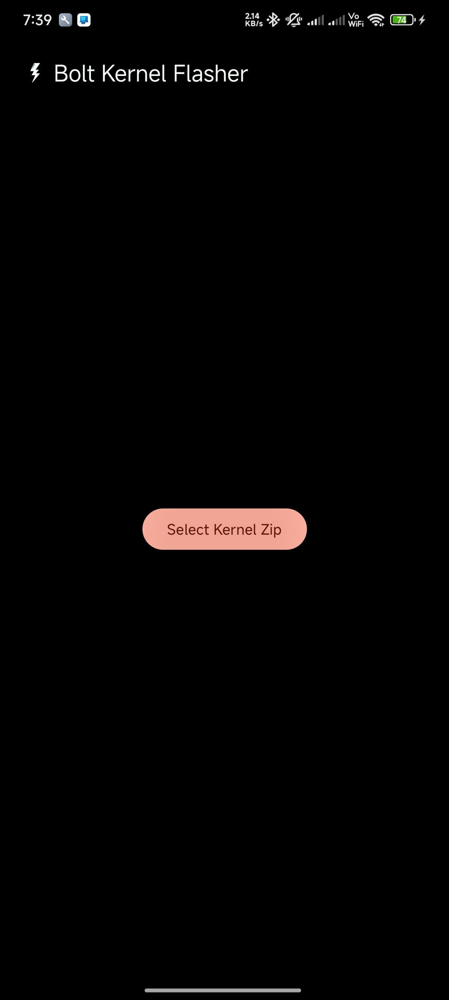
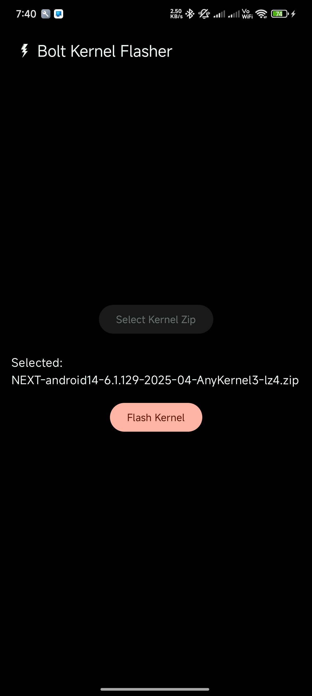
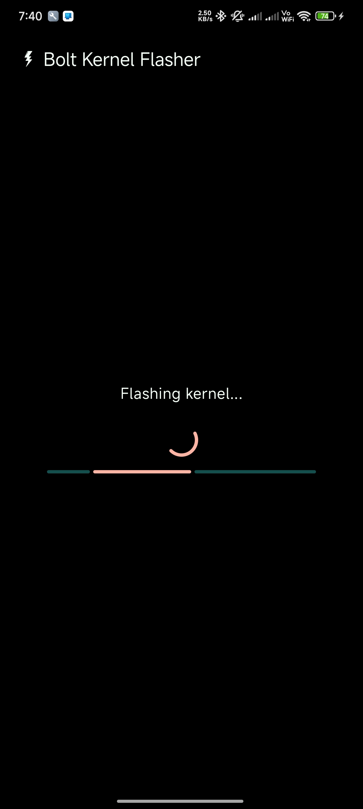
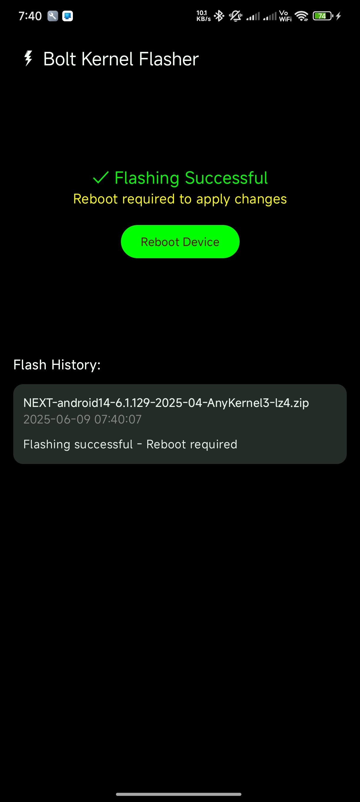
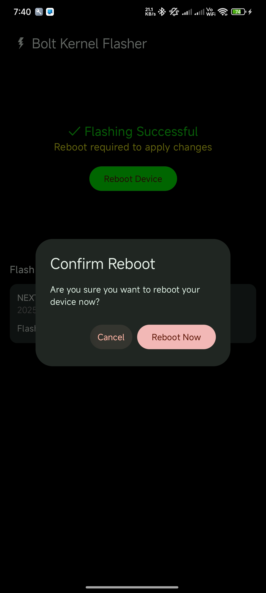

  

<h1 align="center">Bolt Kernel Flasher</h1>

---

## What's This?

Bolt Kernel Flasher is a modern Android application designed to easily flash AnyKernel zips on supported devices. Built entirely with Kotlin, it leverages Material 3 Design and Jetpack Compose for a seamless and intuitive user experience.

### Features

- 100% Kotlin
- Material 3 Design
- Jetpack Compose UI
- Simple and fast kernel flashing
- Supports AnyKernel zips
- Smallest APK size possible (around 1.0 MB)

### Screenshots

### [▶️ Watch Demo](https://youtube.com/shorts/21q9h6YFR3Y?feature=share)<table>
  <tr>
    <td></td>
    <td></td>
    <td></td>
    <td></td>
    <td></td>
    <td></td>
  </tr>

### Warnings

- **Use at your own risk.** Flashing kernels can potentially brick your device.
- **Highly recommended:** Always back up your data and current boot image before proceeding.
- **Check compatibility:** Ensure the kernel format and boot image compression match your device requirements. Mismatches may cause your device to be stuck in a bootloop.
- **Device warranty:** Flashing custom kernels may void your device warranty.
- **Data loss:** Incorrect usage can result in data loss or device malfunction.
- **No liability:** The developers are not responsible for any damage caused by using this tool.

---

## License

This project is licensed under the GNU General Public License v3.0 (GPL-3.0). See the `LICENSE` file for more details.
